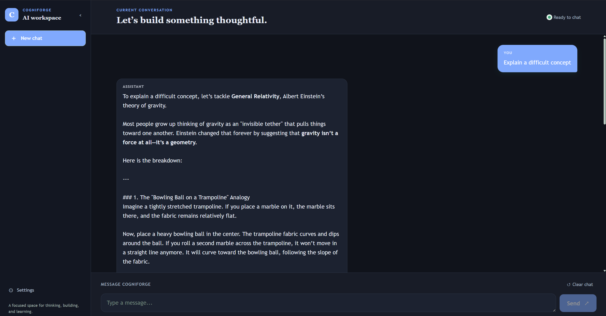

# CogniForge

CogniForge is a full-stack AI workspace that combines general AI conversations with document-based Retrieval-Augmented Generation (RAG). Users can upload PDFs, select documents, ask questions, and receive grounded answers with source references.

## Demo

[🌐 Live Demo](https://cogniforge-f4oq.onrender.com/)



## Features

- Gemini-powered AI conversations
- Multiple independent conversations with persistent history
- Conversation switching, creation, and deletion
- Automatic conversation titles
- PDF upload and text extraction
- Page-aware text chunking and Gemini embeddings
- MongoDB Atlas Vector Search
- Document-grounded RAG responses
- Multi-document library with selection and deletion
- User- and document-scoped retrieval
- Source references with page and similarity information
- Light/dark themes and responsive UI

## Tech Stack

### Frontend

React, Vite, CSS

### Backend

Node.js, Express.js

### AI

Google Gemini API, Gemini Embeddings

### Database

MongoDB, Mongoose, MongoDB Atlas Vector Search

### Other

Multer, PDF.js

## Architecture

```mermaid
flowchart TD
    A[React + Vite] --> B[Express API]

    B --> C[General Chat]
    C --> D[Gemini API]
    C --> E[Conversation Service]
    E --> F[(MongoDB)]

    B --> G[Document RAG]

    G --> H[PDF Extraction]
    H --> I[Page-Aware Chunking]
    I --> J[Gemini Embeddings]
    J --> K[(MongoDB Atlas)]

    G --> L[Query Embedding]
    L --> K
    K --> M[Relevant Chunks]
    M --> D

    D --> N[Grounded Response]
    M --> N

## RAG Pipeline

1. A user uploads a PDF.
2. PDF.js extracts text page by page.
3. Extracted text is split into page-aware, overlapping chunks.
4. Gemini generates an embedding for each chunk.
5. Chunks, embeddings, and page metadata are stored in MongoDB.
6. A document question is converted into a query embedding and searched through MongoDB Atlas Vector Search.
7. Retrieved chunks are provided to Gemini to generate a grounded answer.
8. The response includes source document, page, chunk, and similarity information.

Retrieval is scoped by both user ID and the selected document ID.

## Project Structure

```text
CogniForge/
├── client/
│   └── src/
│       ├── api/
│       └── components/
├── server/
│   ├── controllers/
│   ├── middleware/
│   ├── models/
│   ├── routes/
│   └── services/
└── README.md
```

## Running Locally

### Backend

```bash
cd server
npm install
npm run dev
```

### Frontend

```bash
cd client
npm install
npm run dev
```

Create `server/.env` with:

```env
PORT=5000
MONGODB_URI=your_mongodb_connection_string
GEMINI_API_KEY=your_gemini_api_key
RAG_TOP_K=5
```